# 转载：写一句项目描述，就能生成软著申请材料

# 一句话介绍

你只要输入项目描述，就能快速得到可编辑、可导出的申请材料。

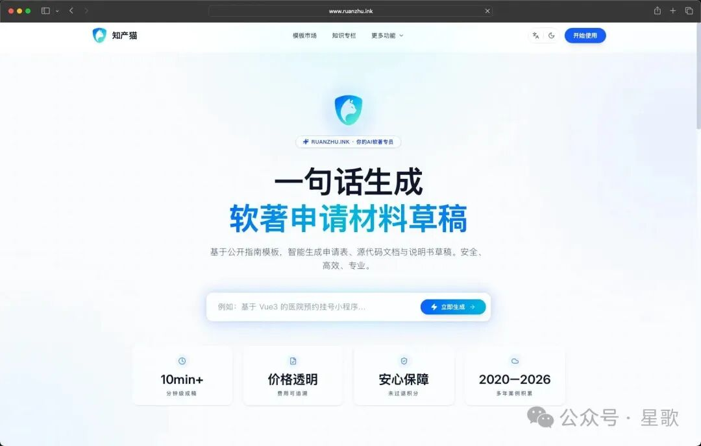

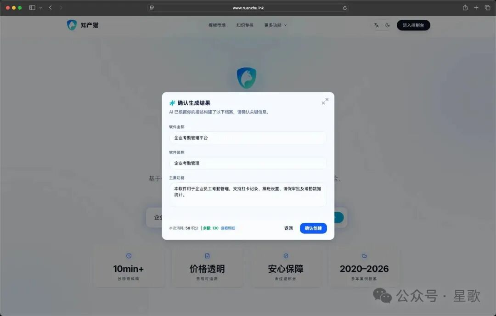

# 用户价值

上手快：一句话创建申请草稿，不懂流程也能开始。

成本低：自己完成大部分材料准备，减少外包依赖。

省时间：说明书和代码材料自动整理，支持直接导出。

可追踪：申请进度、时间线、材料都在一个工作台里查看。

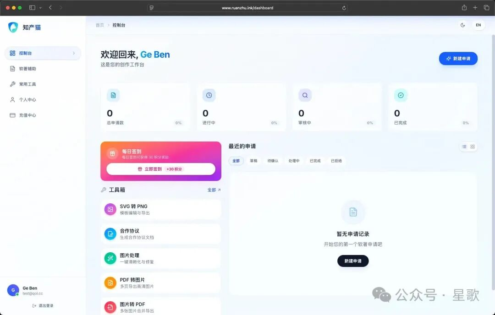

# 用户最关心的功能

## 1. 快速登录与账户安全

邮箱验证码登录、密码登录、Google 登录。

忘记密码找回，支持新用户首次资料完善。

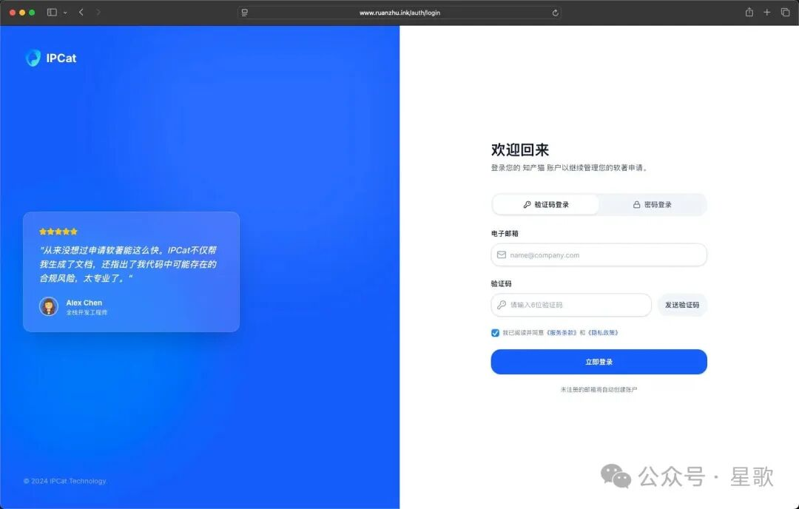

## 2. 软著申请一站式流程

新建申请：填写软件名称、版本、功能描述等核心信息。

智能生成：自动生成申请摘要与基础材料。

申请管理：列表查看、状态筛选、进度追踪。

申请详情：支持在线编辑、提交与重新生成。

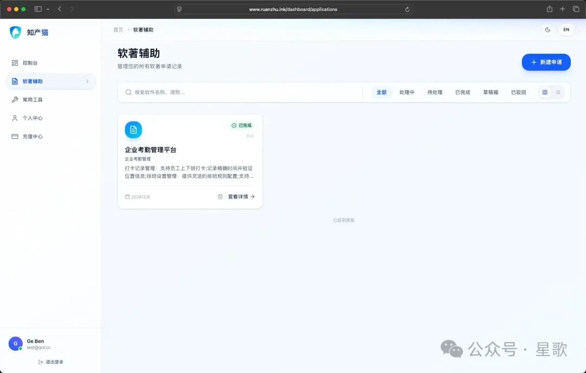

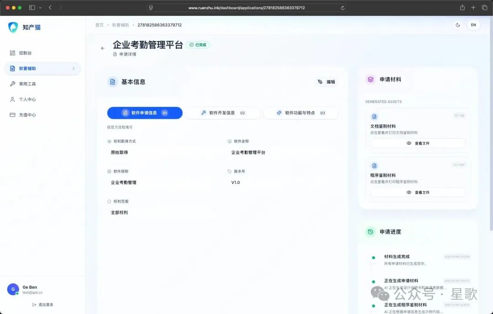

## 3. 材料导出能力（核心）

说明书工作台：Markdown 编辑、图表渲染、打印/PDF 导出。

源代码工作台：代码自动排版、分页处理、打印/PDF 导出。

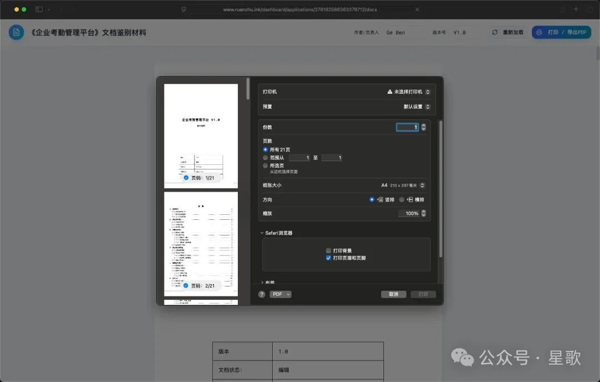

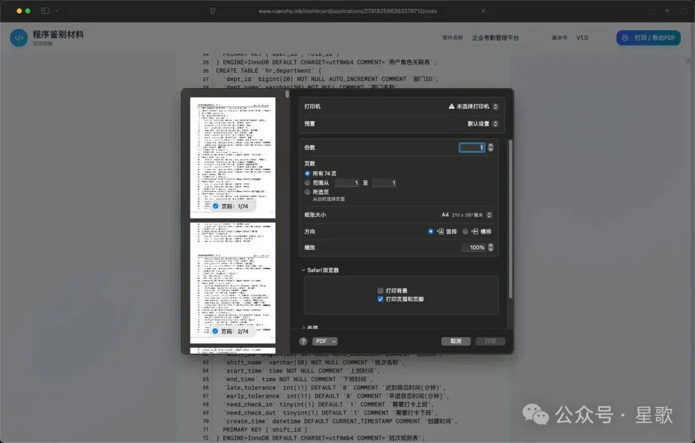

## 4. 实用 AI 工具箱（附加价值）

SVG Studio：在线编辑图形、AI 生成 SVG、导出图片。

图片工坊：抠图、压缩、格式转换、切图。

PDF 转图 / 图转 PDF：日常文档处理更高效。

多模态生成：文生图、图生图、视频生成。

合作协议生成：在线填写并导出。

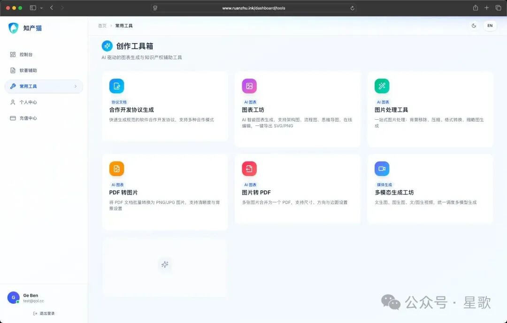

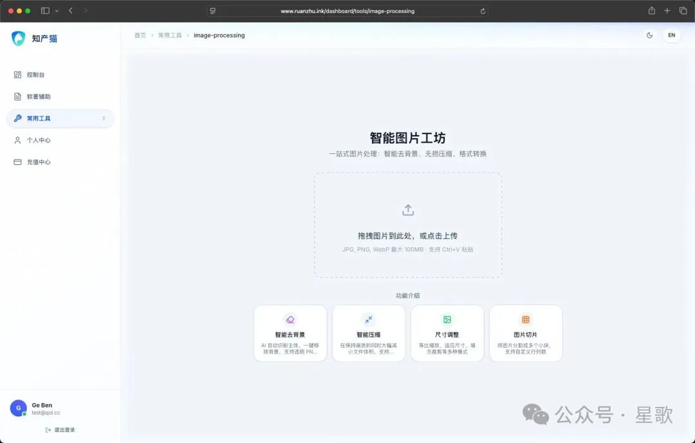

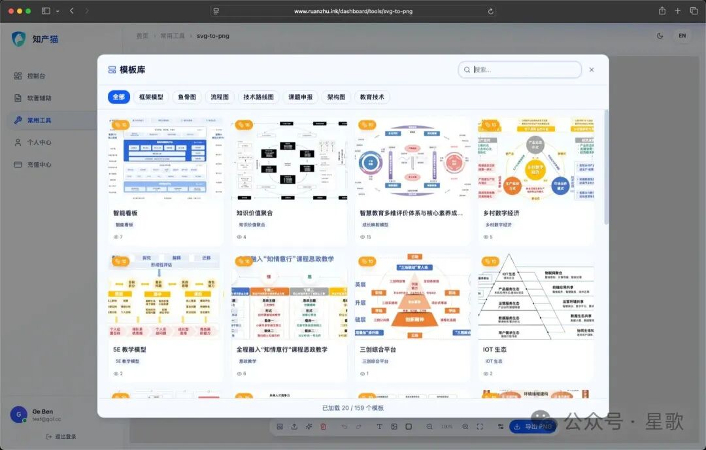

# 适合哪些用户

独立开发者：想快速完成软著材料准备并提交。

自由职业者：希望低成本、自助完成申请文档制作。

小型创业团队：需要稳定、可复用的申请流程模板。

[原文地址](https://mp.weixin.qq.com/s/_H5Vl7CSD5_T7VX7KZM1mA)