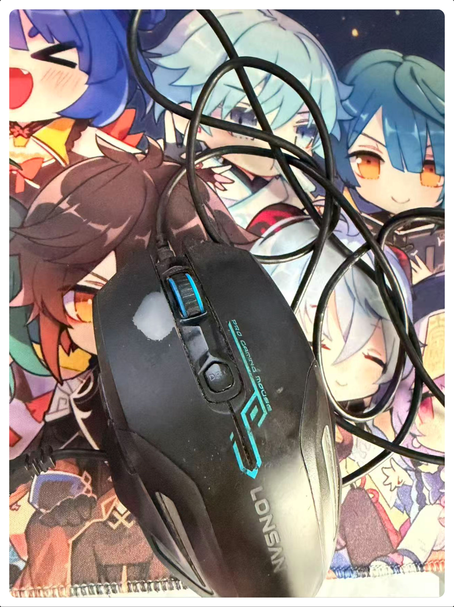
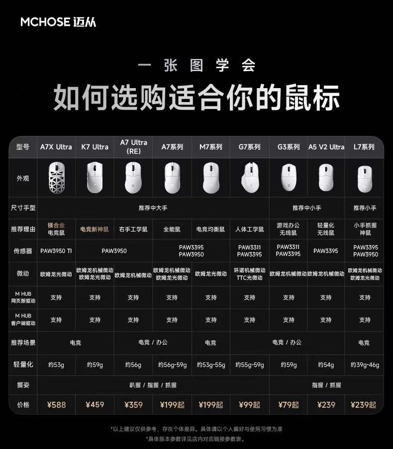
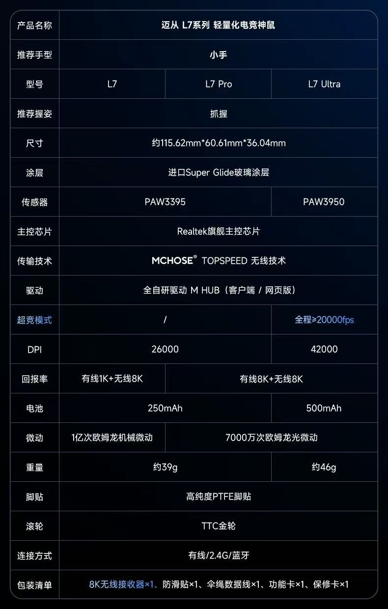
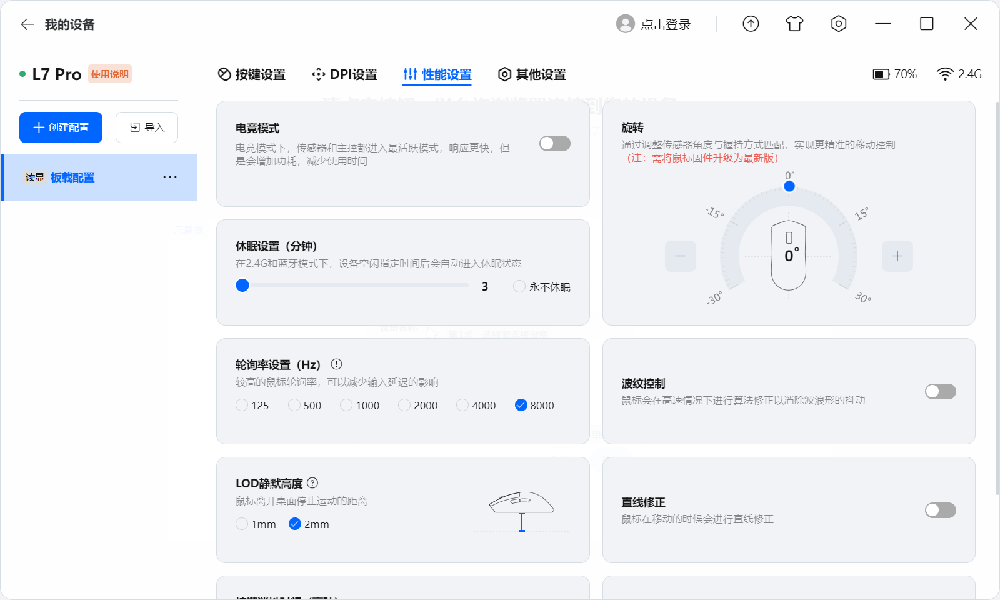
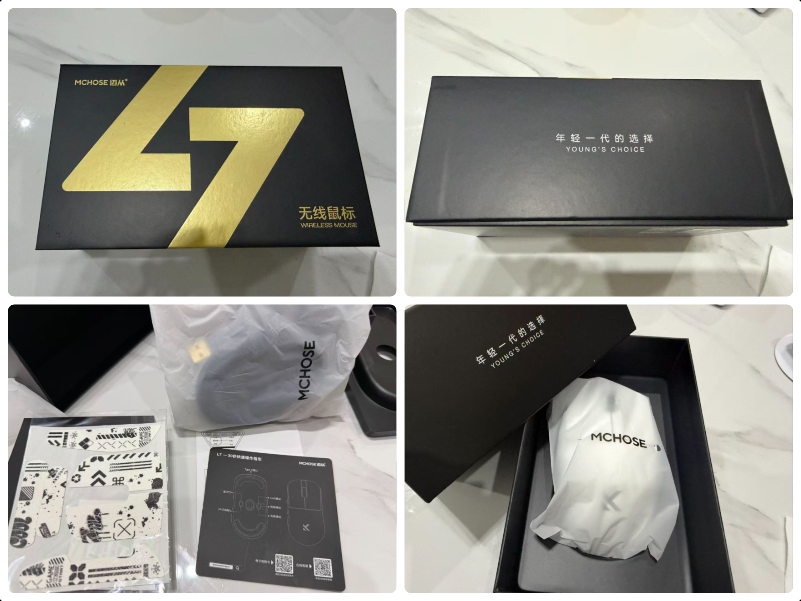
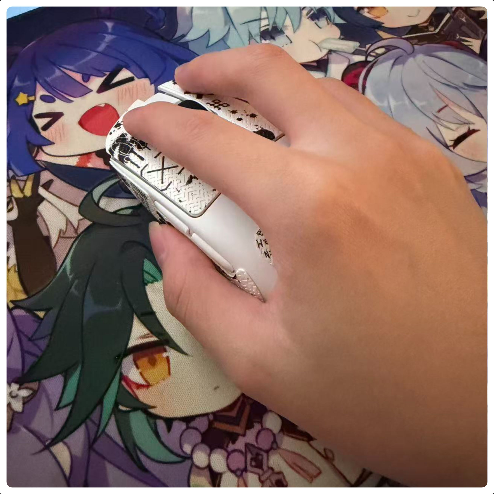

# 迈从L7 Pro开箱 🖱️✨

## 前言

这段时间新工作入职没空写文章，难得空闲，也是借此机会写个开箱文章。⌛📝

之前和我的女朋友提过一嘴，我说：“我的鼠标用了好久了，想换一个新鼠标”。原本打算她是等我过生日的时候送给我，但是周五下班回家，她拿出了一个鼠标包装，在的我惊讶和喜悦中，发现正是我想要换的小手鼠标。🎁💖

选择小手鼠标的原因肯定是因为的我手小，再加上我之前的鼠标和 `L7` 差不多大。

下面开始进入正文。👇

## 老鼠标退休

从初中开始用，算下来差不多用了8、9年了，确切时间记不清了，不过用了这么久竟然没坏，质量还挺好。

下面是包浆图：

## 参数介绍 📊

这里直接拿官方的图片出来了，我个人对鼠标的参数不是很了解，不过咱也不是电竞选手，平时用来打打游戏、办办公应该绰绰有余。🎮💼

`DPI` 最高支持**26000**，我尝试了一下，太快了，掌握不住，我之前的老鼠标也不知道 `DPI` 用的是多少，用了那么久，也没找到驱动，反正用按钮能调节3个档位，慢、中快、快。⚡

我目前 `L7` 用的最舒服的 `DPI` 是**1600**，推演一下估计之前老鼠标的 `DPI` 是**1200**。 

## 驱动展示 ⚙️

驱动页面整体还挺好看，可以设置 `DPI `和开启电竞模式，以及设置鼠标轮询率，最高支持**8000Hz**。

## 包装展示 📦

包装的标语：“年轻一代的选择”，还挺不错。👌

## 上手感觉 ✋

当时开箱拿起这个鼠标的时候就感觉到这个鼠标重量非常轻，比我之前的鼠标轻很多，官方写的重量是**39g**。⚖️

再就是我的选择果然没错，我习惯的握持姿势是抓握，我的小手握上去刚好合适，握着也不会感觉到累。😌

---

## 总结 ✨

总的来说，迈从 `L7 Pro` 是一次非常满意的体验！从惊喜的礼物开箱🎁，到轻巧便携的设计✨，再到舒适的抓握手感🤲，每一个细节都让人感到愉悦。它不仅完美适配了我的小手🖐️，超高的DPI也满足了日常办公和偶尔游戏的需求🎯。感谢女朋友的心意，让这次升级充满了温馨与实用💝。如果你也在寻找一款适合小手的轻量级鼠标，`L7 Pro`绝对值得考虑！👍