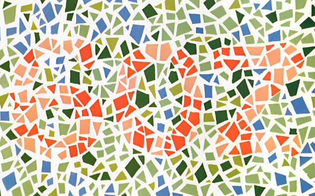
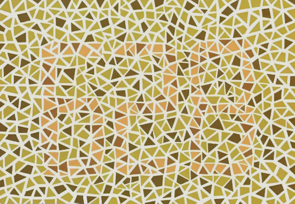

### 《驾照到期换证体检（色弱版）攻略：一场与光影和数字的博弈》

#### 前言：六年一觉驾驶梦，终要面对那本“色卡”

要不是手机日程提醒我，我几乎忘了自己的驾照已经默默陪我走过了六年。这六年里，它陪我淋过江南的雨，吹过海边的风，见证过我凌晨四点起床赶飞机的狼狈，也承载过无数次下班路上电台情歌的温柔。它就像一位沉默的老友，直到提醒闪烁，我才惊觉——该给它“续个命”了。

换证，听起来简单，但对我而言，心里却咯噔一下。因为有一道坎，从我第一次考驾照时就横亘在心头：色觉检测。我，是一个色弱患者。那种面对花花绿绿“色盲本”，被一堆数字和动物支配的恐惧感，时隔六年，卷土重来。我相信，点开这篇文章的你，大概率也懂这种“说不出哪里有问题，但就是看不出来”的无力感。别怕，你不是一个人，这份新鲜出炉的攻略，就是为你我准备的。

#### 科普：我不是色盲，我只是看世界的“滤镜”和你不同

在分享实战经验前，我想先为“色弱”正名。每次跟人解释，都像是一场小型科普。

**简单来说，色盲和色弱，就像“听不见”和“听不清”的区别。**

*   **色盲**，通常是指完全无法分辨某种或所有颜色。比如红色盲，看红色就是一片暗黑或灰色，这在生活中非常少见，且往往是先天性的，他们眼中的世界是非黑即彩的另一种极端。
*   **色弱**，则是“辨色能力不足”。我们不是看不见颜色，而是对特定颜色的感知能力较弱。最常见的红绿色弱，在光线昏暗、颜色饱和度低、色块面积小或者颜色混杂的情况下，很难快速、准确地分辨出红色和绿色，以及由它们衍生的棕、橙、紫等。

这就像一个显示器，正常的色域是100%，而色弱人士的色域可能只有80%，并且某些颜色区域还略微跑偏。我们不瞎，我们只是拿到了一副参数略低的“出厂眼镜”。这种“病”大多是基因自带的，且传男不传女（我就是那个被选中的“幸运”）。它不影响视力，不影响开车时的路况判断（红绿灯的饱和度和波长设计本身就有考虑色弱人群），但在“石原氏色盲检测图”面前，却成了我们必须跨越的心理门槛。

#### 自助体检机实操：一场与机器的孤独战争

苏州中心的这台自助体检机，在一层不算显眼的位置，走进去关上门，外面的嘈杂就都听不见了。

按照屏幕提示，身高、体重、听力，一项项做下来，都还顺利。到了辨色力这一项，心里还是紧了一下。

题目是选择题，一共三张图。图片看着像是**俞自萍色盲检测图第五版或第六版**里的那种，彩色圆点组成数字，让你从几个选项里选。第一张和第二张，我都看出来了，选得还算果断。到第三张的时候，卡住了。盯着看了好一会儿，几个数字都挺像，实在吃不准，最后选了一个，错了。

当时心一沉，但系统并没有直接结束，而是让我继续做剩下的项目。等视力、身高等都测完之后，屏幕提示说色觉这一项需要重新检测一下。

于是又来了一遍，还是三张图，选择题。前两张没什么问题，又到了第三张，还是看不清。说实话当时有点紧张了，盯着屏幕反复看，从不同角度去辨认。隐隐约约觉得有个数字的轮廓，但不确定是不是自己看花了眼。

选项出来之后，我犹豫了一下，还是选了那个隐约看到的数字。

这次对了。体检通过。

整个过程不到二十分钟，没有人催，也没有人在旁边看着。错了可以重来一次，这大概就是自助体检机对色弱人群最友好的地方。

#### 色弱图举例

我从俞自萍色盲检测图第五版或第六版选了3张出来，从简单到困难，测试你能看清楚吗！

*正确答案：熊猫、602、628，我能看到熊猫和602,第二张图602有混淆，色弱看到是98，但是我2个数字都能看到。最后一张628我看不到，也不知道我是什么颜色色弱导致的。*

#### 总结：越过山丘，才发现不过如此

新驾驶证从机器里吐出来的时候，我拿在手里看了看，照片拍得比六年前那张好一点，纸质还带着打印的余温。

换证之前想了很多，怕卡在色觉检测上，怕白跑一趟。实际走下来，前后不到半小时就办完了。中间确实在辨色力那儿错了一次，但系统让重测，第二次过了，也就过了。

回想起来，考驾照那次体检是在老家，老家很宽松，给我看得单色卡，最后给我过了。这些年开车上路，红绿灯从没看错过，该停停，该走走，色弱这事在实际驾驶中其实没什么影响。只是每次碰到体检，心里还是会咯噔一下，大概是从小到大被那些检测图给问怕了。

自助体检机的好处是，没人站在旁边看你答题，错了机器也不会叹气皱眉，重来一次就是了。对于和我一样有色弱的人来说，这大概是最友好的一种方式了。

写这篇记录，不是教人怎么钻空子，只是把自己经历的写下来。如果你也正准备换证，看到这里，希望能让你少一点紧张。没想象中那么难，去办就是了。

<b>本文主体部分由AI编写，不过确实是博主的亲身经历，这也是第一次用ai描述经历，ai味还是很浓的。</b>